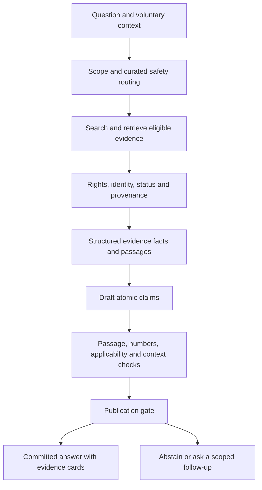

# Medical evidence verification and native iPhone feasibility

Research checked 2026-10-02. Accepted first-release scope: education and doctor-visit preparation for patients/caregivers; native iPhone with a hosted service; English and Indonesian; research papers plus explicitly labeled clinical guidelines and official drug information; **Indonesia first launch**. This report is research and design guidance, not an implemented system or a regulatory determination.

## Recommended product contract

Publish medical statements only when the system can show the exact supporting material, preserve its context and numbers, and expose its limitations. Say **“Supported by the cited source”**, not “medically proven,” “100% accurate,” or “verified true.” A genuine paper and a matching passage establish attribution; they do not establish that the study is unbiased, definitive, current, or applicable to this person.

Separate three judgments in the user interface: **source support**, **certainty of the evidence**, and **applicability**. A statement can accurately describe a low-certainty finding from a population unlike the user. Cochrane assesses certainty for a body of evidence about a particular outcome using risk of bias, inconsistency, indirectness, imprecision, and publication bias; its four levels are high, moderate, low, and very low. Do not have an LLM invent a formal GRADE assessment from a citation count. Show a published assessment with provenance, or state that certainty has not been formally assessed. [Cochrane Handbook, Chapter 14](https://training.cochrane.org/handbook/current/chapter-14).

For visit preparation, keep “You reported…” information separate from medical evidence. Preserve the user's words, distinguish unknown from negative, and let the user correct the summary. Conversational text, UI instructions, and descriptions of what the service did are not medical findings and do not need artificial paper citations.

## Why retrieval and citations alone are insufficient

The original ALCE research distinguishes answer correctness from citation quality and evaluates support and completeness. It is a useful basis for claim/citation metrics, but is a general information benchmark rather than clinical validation. [Gao et al., EMNLP 2023](https://aclanthology.org/2023.emnlp-main.398/).

A primary expert evaluation, available as a November 2025 preprint, studied 800 outputs for 200 patient and exam-style queries from GPT-4o and Llama-3.1-8B. Eighteen experts supplied 80,502 annotations. Only 22% of top-16 retrieved passages were relevant; evidence selection precision was 41–43% and recall 27–49%. Standard RAG reduced factuality and completeness in some comparisons. These are results for that setup, not failure rates for all RAG systems. It supports evaluating retrieval, selection, and generation separately. [Kim et al., original preprint and methods](https://arxiv.org/html/2511.06738v1).

An academic position paper with quantitative and qualitative analyses argues that individually accurate citations can still mislead patients through selective framing, missing context, and reinforcement of misconceptions. This is evidence about communication failures, not a randomized clinical outcome trial. [Wong et al., June 2025 version](https://arxiv.org/html/2502.14898v2).

These sources are primary academic work, distinct from product-vendor accuracy assertions. They establish reasons for skepticism and an evaluation design; they do not validate this project's proposed architecture. No vendor claim of “no hallucinations” should substitute for testing the actual deployed model, corpus, language, and patient tasks.

## Evidence access and updates as of the research date

| Provider | Defensible role | Implementation implications |
| --- | --- | --- |
| PubMed | Search citations and retrieve structured bibliographic records/abstracts with ESearch and EFetch. | Retrieve IDs and records through documented E-utilities; resolve supplied/generated identifiers against authoritative metadata. PubMed search is not full-text rights clearance. [NCBI E-utilities documentation](https://www.ncbi.nlm.nih.gov/sites/books/NBK25499/pdf/Bookshelf_NBK25499.pdf). |
| PubMed status relationships | Structured corrections, retractions, expressions of concern, and updates. | Parse `CommentsCorrections` and relationship direction: `RetractionIn` points from an original article to its notice, while `RetractionOf` describes the notice's target. Also inspect publication types. Schema examples are historical documentation, so verify compatibility with the current EFetch schema during implementation. [NLM CommentsCorrections schema](https://dtd.nlm.nih.gov/ncbi/pubmed/doc/out/180101/el-CommentsCorrections.html), [NLM current editing documentation](https://www.ncbi.nlm.nih.gov/pubmed/management/help/editing-single/). |
| PMC | Reusable full text in JATS XML and other article datasets, subject to each article's rights. | **The OA Web Service was discontinued August 25, 2026.** Avoid the legacy OA discovery API. Legacy dataset files were removed in the August 2026 transition. Follow current Article Datasets/Cloud documentation; datasets can contain notices as well as ordinary papers. [Discontinuation notice](https://pmc.ncbi.nlm.nih.gov/tools/oa-service/), [PMC Article Datasets](https://pmc.ncbi.nlm.nih.gov/tools/textmining/). |
| PMC OAI-PMH | Metadata for all PMC items and full text where reuse rights permit. | Current base is `https://pmc.ncbi.nlm.nih.gov/api/oai/v1/mh/`; use `GetRecord`/`ListRecords`, `metadataPrefix=pmc` for full text and `set=pmc-open` for retrievable full text. Honor resumption tokens and the documented no-concurrent-requests rule and 3 requests/second ceiling. An error/access denial must not become an invented passage. [PMC OAI-PMH](https://pmc.ncbi.nlm.nih.gov/tools/oai/). |
| Europe PMC | Literature search, metadata, abstracts, OA full text, and article-status search. | REST `search` with `resultType=core`; `/{id}/fullTextXML` for its OA subset; documented `POST /status-update-search` for status updates. Match PMID/PMCID/DOI and source codes rather than titles alone. Read the actual operation schema before constructing status-update requests. [Europe PMC REST documentation](https://europepmc.org/RestfulWebService). |
| Crossref | DOI identity, license metadata, deposited post-publication changes, and Retraction Watch data. | `/works/{doi}`, update relationships, `has-update`, `is-update`, `updates`, and `update-type` filters support status checking. Use `from-index-date` for synchronization that includes changes from external sources. Metadata may be incomplete; absence of an update is not proof of a clean article. [REST API](https://www.crossref.org/documentation/retrieve-metadata/rest-api/), [filter definitions](https://www.crossref.org/documentation/retrieve-metadata/rest-api/rest-api-filters/). |
| ClinicalTrials.gov, optional enrichment | Linked study registration, eligibility, outcomes, and posted results when available. | Use v2 rather than the retired classic API. Connect papers to their actual NCT ID and distinguish enrollment from the analysis denominator. A registration is not a peer-reviewed result. [NLM API v2 announcement](https://www.nlm.nih.gov/pubs/techbull/ma24/ma24_clinicaltrials_api.html), [official single-record extraction guidance](https://www.nlm.nih.gov/pubs/techbull/ja25/ja25_clinical_trials_screen-scraping.html). |

Access is not a blanket license to redistribute. PMC and Europe PMC distinguish accessible content from content permitted for mining/reuse; check each item's rights before storing, embedding, quoting, transforming, or displaying it. Do not scrape publisher paywalls. For a commercial service, noncommercial or no-derivatives restrictions require separate review rather than assuming every OA paper is eligible. Store the license URL, version, attribution, allowed operations, and retrieval basis. [PMC rights and dataset distinctions](https://pmc.ncbi.nlm.nih.gov/tools/textmining/), [Europe PMC reuse help](https://europepmc.org/help).

Crossref bibliographic metadata is broadly reusable, but some abstracts remain copyrighted by publishers/authors. Its Retraction Watch database is CC0 and its downloadable CSV is updated daily. DOI metadata is not permission to redistribute an article or its abstract. [Crossref metadata retrieval and rights](https://www.crossref.org/documentation/retrieve-metadata/). Rights review depends on the planned use and is not a legal conclusion supplied by this report.

If only an abstract is available, label **“Abstract reviewed”** and support only what is present there. Do not claim the methods, adverse events, supplementary tables, subgroup analyses, or raw observations were checked. An abstract may support a limited study-description claim; it cannot satisfy a full-data requirement when the necessary data are missing. Mark missing fields as “not reported in accessible material,” then narrow the answer or abstain. Show a publisher/library link without bypassing access controls.

## Proposed pipeline and module seams

Everything in this section is a proposed engineering choice derived from the preceding risks, not a claim that the cited studies implemented or validated this exact design.

1. **Scope router.** Classify education/visit preparation versus requests for a diagnosis, medication change, or individualized treatment instruction. Apply clinician-reviewed routing and boundaries; do not treat a disclaimer as a technical control. Education can explain published research; it should not quietly transform into a recommendation for this individual.
2. **Evidence repository.** Hide provider-specific APIs, parsing, licensing, ID resolution, caching, and status checking behind one interface returning stable evidence IDs and immutable document versions. Search with biomedical synonyms and relevant population/intervention/comparator/outcome context. Consider multiple retrieval formulations and negative/conflicting evidence, rather than making the highest similarity score the answer.
3. **Evidence facts.** Extract candidate facts into structured records with source spans and table context. Preserve originals; normalized values are additional fields. Treat article text as untrusted data, never as instructions to the system. Prefer JATS tables and prose over unreviewed PDF/OCR extraction; block numerically ambiguous extraction.
4. **Claim builder.** Draft bounded statements using only supplied evidence IDs. Split conjunctions and qualifiers into independently checkable propositions. A sentence containing an efficacy claim, duration claim, and adverse-event claim requires support for all three. “May,” negation, subgroup, and causality qualifiers are part of the claim.
5. **Verifier.** Resolve each claim to direct spans and assess entailment, including negation, scope, causality, and uncertainty. Relevance is insufficient. Use deterministic schema/numeric rules alongside a separately calibrated entailment model; a different prompt to the same LLM is not an independent guarantee. Flag disagreements and ambiguous support rather than voting uncertainty away.
6. **Publication gate.** Allow only publishable statements through a versioned policy; inspect the complete rendered response for new claims, misleading omissions, and contradictory phrasing. Remove or rewrite unsupported propositions, then reverify the final text. If remaining material cannot answer the question coherently, abstain rather than assembling a misleading fragment. High-risk or unresolved items need human review or must stay outside first-release scope.

Suggested seams: `EvidenceRepository`, `EvidenceFacts`, `ClaimVerifier`, `AnswerPublisher`, and a versioned `SafetyContent` store. The public API should expose committed answers and their evidence, not provider prompts or arbitrary raw generations. No application module changes were made by this research task.

### Minimum provenance and numeric contract

| Record | Required fields and rules |
| --- | --- |
| Source | Internal stable ID; PMID/PMCID/DOI when present; original title/authors/date; paper/guideline/drug-label type; peer-reviewed/preprint status; document version and content hash; source URL; access level; rights record; fetched and status-checked timestamps; correction/retraction relationships. |
| Study | Study design; actual linked registry ID if available; country/setting; inclusion/exclusion and population; intervention/comparator; endpoint definitions; follow-up; funding/conflicts when reported. Group multiple reports of the same study to avoid double-counting. |
| Passage | Document version/hash; section and paragraph/table/cell/footnote location; exact original span; neighboring qualifiers; whether translation/OCR was used. A bibliography entry alone is not evidence support. |
| Claim | Stable claim ID; displayed text; medical/nonmedical classification; supporting and contradicting spans; support outcome; extraction limitations; applicability limitations; final reviewer/policy/model version. |
| Numeric fact | Original value and text; unit; numerator and outcome-specific denominator when reported; analysis population; comparator; time window; effect type and direction; adjusted/unadjusted status; confidence interval and level; uncertainty qualifier; table footnotes. Never replace a missing denominator with total enrollment. |
| Calculation | Explicit formula, input evidence IDs, valid units, rounding policy, and a “calculated from reported data” label. Avoid unsupported derived clinical measures. Store the unrounded result and do not infer a CI from a point estimate. |

Deterministic checks must reject unit/scale changes, mismatched populations or timeframes, swapped comparator directions, and confusion between relative and absolute effect. A risk ratio of 0.8 does not supply an absolute reduction without the relevant baseline risk; an odds ratio is not a risk ratio. A pooled analysis's total sample cannot be casually paired with one subgroup result. Test positive percentages, decimal separators, ranges, and table footnotes in both languages.

“Show the data” should mean the **reported study data**, not a claim to possess raw participant data. Offer the study design and population, endpoint/timeframe, reported group results or effect estimate, CI if available, support passage, access limitation, and source link. Only expose a raw dataset when it is actually available, relevant, licensed, and appropriate. Never invent individual rows to visualize aggregate findings.

### Uncertainty, conflict, and bilingual output

Show conflicting results together, including population/design/timeframe differences. Do not count papers as votes or pool incompatible outcomes automatically. Mark preprints and superseded guidance. If evidence is sparse, say so; do not interpret failure to retrieve evidence as evidence of no effect. Evidence-applicability checks should consider age group, pregnancy when relevant and voluntarily known, setting, condition severity, and intervention/comparator differences; unknown context remains unknown.

For Indonesian output, retain original evidence spans and provide a clearly labeled translation. Verify the rendered translated claim again against the original facts; translation can alter medical qualifiers or numbers. Validate drug generic names and local terminology separately from brand availability. Evaluate Indonesian clinician/patient interpretation rather than assuming English benchmark results transfer.

### Fail-closed publication and safety content

Recommended answer states: `queued → retrieving → checking → ready` or `insufficient_evidence`/`blocked_by_scope`. Support outcomes within an evidence card can be `supported`, `partially_supported`, `contradicted`, or `not_assessed`; only the supported proposition should be presented as medical answer content. A qualified statement about uncertainty can itself be supported by the underlying conflicting evidence.

Do not stream unverified clinical tokens, including to speech, notifications, cached previews, or accessibility announcements. Stream only neutral progress events while checking, then release the committed answer. A disconnected client must not display an unfinished draft. Keep retrieval/verifier failures, rate limits, inaccessible text, or missing status checks from silently triggering an uncited model fallback. Enforce a maximum evidence-status age chosen for the topic; stale status is a distinct state, not “not retracted.”

Retraction monitoring should invalidate derived claims and identify saved answers for a correction notice. Retain an audit record of what was shown, its source version and check time; do not silently rewrite the history. Quarantine retracted sources from ordinary supporting evidence. Corrections or expressions of concern require targeted re-review, and absence of notices across APIs is not proof that none exist.

**Proposed explicit exception requiring product/clinical agreement:** emergency-routing and other safety instructions may use versioned, clinician-reviewed official guidance rather than wait for research-paper retrieval. Label them “Safety guidance” with their actual authority and update date. The accepted guideline/drug-information expansion enables honest attribution; never fabricate a paper to force a safety statement into a papers-only badge. Indonesia-specific emergency instructions and their regional availability still need verification and clinical approval. A generic language model should not improvise the safety policy.

## iPhone implementation and release feasibility

A native client can use SwiftUI for the interface and `URLSession` for HTTPS networking. `URLSession.bytes(for:delegate:)` returns asynchronous bytes with text `lines`, which can consume a framed progress/event protocol. This is transport support, not permission to expose unchecked output. [SwiftUI](https://developer.apple.com/documentation/swiftui), [Apple URLSession AsyncBytes](https://developer.apple.com/documentation/foundation/urlsession/bytes(for:delegate:)).

Recommended hosted architecture: keep credentials, retrieval indexes, status synchronization, model calls, and the publication gate server-side. Send the iPhone a typed committed answer with stable claim/evidence IDs, grouped data cards, support limitations, checked date, and visit-summary controls. Use explicit consent and data minimization for hosted processing; do not include user details in public literature-provider queries if biomedical concepts suffice. Keep secrets out of the binary and avoid clinical content in analytics, crash logs, or push notifications.

On a narrow screen, prioritize the plain-language answer and an adjacent “Evidence” action for each medical statement. Open a sheet containing the support passage, study context, reported numbers, uncertainty, and conflicting findings; preserve a direct original-source link. VoiceOver and Dynamic Type must expose the same support and limitations as the visual UI. This is a design recommendation that needs usability testing, particularly for Indonesian readers and caregiver access.

Native compilation, signing, simulator, and device testing need an Apple build environment. Apple's Xcode support matrix specifies supported macOS/SDK/device versions. This Windows workspace can prepare backend/contracts and Swift source, but cannot establish a successfully built, signed, device-tested iPhone app without a compatible Mac or macOS build service. Select the minimum deployment target and supported SDK from the matrix at implementation time. [Apple Xcode system requirements](https://developer.apple.com/xcode/system-requirements/).

HealthKit is optional, not required for evidence-backed education or visit preparation. Apple's framework has permission per data type, usage-description requirements, and restrictions on disclosure/advertising. Read denial is deliberately indistinguishable from no accessible data, so absence must never be interpreted as a normal clinical result. Keep it out of first release unless a defined feature needs it and its consent/data flow is designed. [Apple HealthKit privacy](https://developer.apple.com/documentation/healthkit/protecting-user-privacy).

Apple's current review rules apply beyond HealthKit: medical apps may receive extra scrutiny; accuracy claims for measurements require disclosed data/methodology; users should be reminded to consult a doctor. Healthcare/sensitive-data services should be submitted by the service's legal entity. The rules require explicit permission before personal data is shared with third-party AI, prohibit storing personal health information in iCloud, and restrict medical-data advertising/mining. Health research with human participants has additional consent/ethics requirements. Prepare a working backend/demo, privacy policy and retention/deletion controls, accurate app metadata, and device verification before submission. Educational positioning does not eliminate these rules. [Apple App Review Guidelines, 1.4.1, 2.1, 5.1.1–5.1.3](https://developer.apple.com/app-store/review/guidelines/).

## Market and intended-use decisions

The confirmed education/visit-preparation scope is a practical starting point, but classification depends on actual features and claims, not merely the app category or disclaimer. FDA policies assess software functions across platforms and distinguish non-device functions, enforcement discretion, and regulated devices. [FDA mobile/device software overview](https://www.fda.gov/medical-devices/digital-health-center-excellence/device-software-functions-including-mobile-medical-applications).

As comparative context for a possible later US launch, the current CDS guidance is **January 29, 2026**, superseding the January 6 version. Its specific non-device CDS exclusion concerns recommendations to healthcare professionals who can independently review their basis, subject to all four criteria. Patient/caregiver functions follow other applicable policies; adding citations does not automatically qualify them for that exclusion. FDA's FAQ also says failure to meet a CDS criterion does not by itself settle regulation and identifies simple patient information organization/communication functions as non-device examples. This US context is not an Indonesia compliance conclusion. [Current FDA guidance PDF](https://www.fda.gov/media/109618/download), [FDA CDS FAQ](https://www.fda.gov/medical-devices/software-medical-device-samd/clinical-decision-support-software-frequently-asked-questions-faqs).

For the confirmed Indonesia launch, do not import FDA classification as the local answer. The ministry's in-force **Permenkes 11/2025** replaces earlier risk-based business-licensing standards; its medical-device documentation requirements explicitly include testing documents for SaMD, SiMD, and AI software, alongside clinical evidence and risk-management documents (printed pages 390 and 403). This establishes that medical software is addressed, not that this educational chatbot has a specific class or authorization path. Determine applicability to the education/visit-preparation functions with Indonesian regulatory expertise before public deployment, especially before expanding to personalized triage, dosing, diagnosis, or treatment. [Ministry legal record](https://jdih.kemkes.go.id/documents/peraturan-menteri-kesehatan-nomor-11-tahun-2025), [official regulation PDF](https://jdih.kemkes.go.id/storage/documents/pdfs/2025permenkes011.pdf).

Indonesia's personal-data law identifies health information as specific personal data. The launch therefore needs a concrete controller/processor, retention, user-rights, and hosting/cross-border review. This report does not resolve those legal obligations or establish a local-hosting requirement. [Official UU 27/2022 record](https://peraturan.bpk.go.id/Details/229798/uu-no-27-tahun-2022-10).

## Evaluation plan before any accuracy promise

Use a clinician-authored/adjudicated corpus independent of the generator and verifier, and reserve held-out topics and time periods. Include multilingual patient wording, conflicting/null evidence, table-only results, abstract-only sources, corrections/retractions, unseen citations, inaccessible providers, ambiguous context, and out-of-scope requests. Compare uncited generation, ordinary RAG, and the gated design for analysis; do not expose unsafe baselines to patients. Treat model-judge scores as development signals and calibrate them against blinded human review.

| Metric | Meaning |
| --- | --- |
| Atomic-claim coverage | Fraction of independently annotated medical propositions actually captured by the claim splitter; catches missed qualifiers and implications. |
| Citation support precision | Fraction of displayed claim–source links that adjudicators find entailing, with false-support rate and confidence interval. |
| Clinical-claim support coverage | Fraction of all displayed medical propositions with adequate support; denominator includes uncited claims added by rendering/translation. A 100% system gate is an invariant, not evidence of 100% clinical accuracy. |
| Numeric fidelity | Correct value, unit, comparator, population, denominator, endpoint/timeframe, and CI when reported; report errors by field and severity. |
| Applicability/context | Inappropriate extrapolation and omission of clinically material context, scored separately from literal support. |
| Retrieval | Expert-relevant passage precision/recall at chosen limits; whether contrary and current evidence was retrieved. |
| Abstention | Answerable queries wrongly declined and unanswerable/out-of-scope queries wrongly answered; report useful-answer coverage alongside errors. |
| Safety and scope | Harmful advice, unauthorized personalized diagnosis/treatment, and emergency-routing errors against clinician-reviewed cases. |
| Operations | Evidence-update/retraction detection latency, missed invalidations, stale answers served, provider-failure behavior, p50/p95 latency and cost. |
| User comprehension | Whether patients understand support versus certainty, relative versus absolute results, and population limitations in both languages. |

Set proposed pilot invariants now: no invented/unresolved citations; no unchecked clinical output; all published medical propositions linked to support records; zero known retracted sources used as ordinary support. Clinicians must define acceptable residual error and a meaningful sample size by severity and task. Zero observed errors in a small test does not justify a population guarantee. No universal accuracy percentage or clinical release threshold was found that can responsibly be copied into this project.

## Decisions still owned by the user and clinical team

- Indonesia launch entity, feature classification review, and hosting/data-processing choices; additional launch countries remain separate future decisions.
- First clinical topics and exclusions, supported ages, caregiver access, and who approves safety content.
- Whether abstract-only findings can be shown, how missing “data” fields are presented, and the corpus licensing budget.
- The local guideline/drug-information authorities and refresh policy; published guidance must be labeled separately from study findings.
- Retention and correction handling for saved answers/visit summaries; optional account and export behavior.
- Minimum iOS target, compatible Mac/build service, clinician evaluation budget, and bilingual usability validation.
- Severity-based release thresholds and the evidence required before any external accuracy claim.

These decisions should be recorded before implementation commitments. The recommendations here remain provisional where those choices change scope; no medical efficacy, regulatory approval, App Store approval, or completed iPhone build is claimed.
